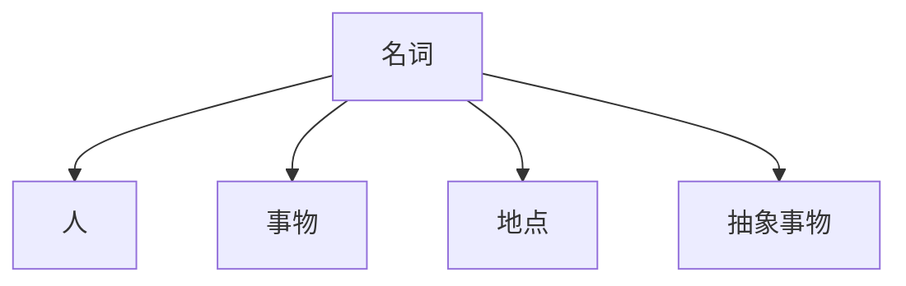

# New perspective Grammar 初级教程

## Chapter1

### 名词的定义1.1

#### 1.1.1

名词是用来表示人、事物、地点以及抽象事物的名称

人：John(人名)，sister

事物：water, air,sum

地点：London，theater

抽象事物:love, happiness,imagination,hope

#### 1.1.2名词的分类

专有名词：

1. 人物及头衔
2. 著作名称
3. 月份：January,February,March,April,May,June,July,August,Septemper,October,November,December
4. 星期:Sunday,Monday,Tuesday,Wednesday,Thursday,Saturday
5. 节日
6. 地理名称

普通名词：

根据“是否可以被分割”分为可数名词和不可数名词

简单的名词和复合名词（由若干个名词组合成的复合名词etc：girlfriend,roommate,mother-in-law）

### 名词的数：可数与不可数

#### 1.2.1

第一组：对于一些无法分割的名词

Group A：

| Air               | coffee      | oil   | tea     |
| ----------------- | ----------- | ----- | ------- |
| blood             | electricity | paper | Thunder |
| bread             | glass       | pork  | Water   |
| Butter            | milk        | soup  | Yogurt  |
| Cholesterol胆固醇 | milk        | soup  | Yogurt  |

第二组：一些因其组成部分太小不易于数的名词

Group B:

| corn爆米花 | popcorn | Sand  |
| :--------- | ------- | ----- |
| grass      | rice    | snow  |
| hair       | salt    | Sugar |

第三组：表示总称的名词

Group C:

| 表示总称概念（不可数） | 表示总称概念下的具体事物（常可数也有一些不可数） |
| ---------------------- | ------------------------------------------------ |
| clothing               | Sweaters,pants,dresses                           |
| food                   | Vegetables,eggs,hamburgers                       |
| furniture              | Chairs,tables,beds,cabinets,wardrobes(衣柜)      |
| fruit                  | Apples,oranges,bananas,cherries,grapes           |
| luggage                | Bags,suitcases(手提箱)                           |
| Makeup（化妆品）       | Lipsticks(口红)，rouge（胭脂），eyeshadows(眼影) |
| homework               | Compositions(作文)，exercises,readings           |
| housework              | Cleaning,dusting,cooking                         |
| Jewelry                | Rings earring necklaces bracelets(手镯)          |
| Money/cash             | Nickels(五分硬币) dimes quarters dollars         |

| machinery     | machines            |
| ------------- | ------------------- |
| equipment     | tools               |
| poetry        | poems               |
| Scenery       | Scenes,scenic spots |
| character特点 | Characteristics     |

第四组：抽象的名词一般是不可数的

Group D:

| Advice     | fun          | life      | patience     |
| ---------- | ------------ | --------- | ------------ |
| art        | happiness    | love      | pollution    |
| beauty     | health       | luck      | time         |
| crime      | help         | music     | trouble      |
| education  | information  | nature    | truth        |
| energy     | intelligence | noise     | unemployment |
| experience | knowledge    | nutrition | work         |

第五组：表示研究学科，一般为不可数

| biology（生物学） | Geometry(几何学) | history |
| ----------------- | ---------------- | ------- |
| chemistry         | grammar          | Math    |

### 1.2.2可数与不可数相对论

可数与不可数关在在于它在文中所要表达的意思，名词的可数性重在意义而不是形式，与使用的语境有关，意义和语境的不同的不同会导致名词的可数性不同。

#### 规律1

对于物质名词或总称名词，若是表示不同种类，特定的意思，若是液体表达“几杯、几瓶”数量，可以化成可数名词

#### 规律2

抽象名词若是具体化可以化为可数名词。

### 规律3

当一个名词表示抽象、总称的概念的时候，当做不可数。当一个名词表达具体的、特定的事物时，则可以当作可数名词。
